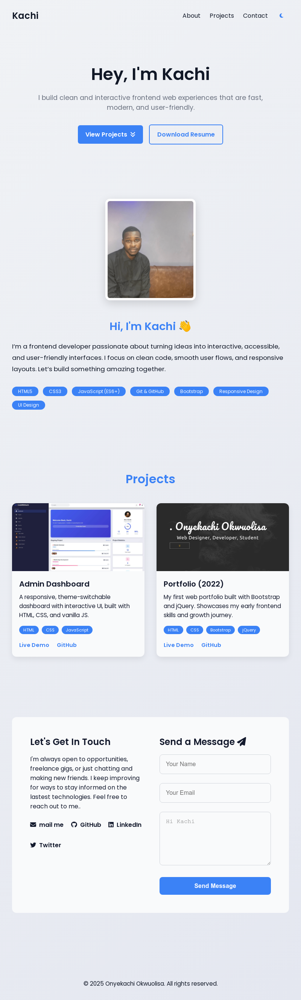

# Kachi Portfolio

A clean, responsive, and professional frontend developer portfolio built with **HTML**, **CSS**, and **vanilla JavaScript** — with support for **dark mode**, **Netlify form handling**, and smooth animations.  

---

## 📌 About This Project

This is my updated portfolio site, designed to reflect my current frontend skills and developer personality. It introduces who I am, showcases a few of my best projects, and provides a way for people to contact or hire me.  

I built it from scratch without frameworks, using custom layout and styling, to stay in full control of the responsiveness, animation, and user experience.

## 🚀 Deployment

This site is live and hosted on **GitHub Pages**.  
You can view it here → [Live Preview](https://on2onyekachi.github.io/Kachi-Portfolio)

## 📷 Preview
Below is a snapshot of the responsive design on tablet view.
 

---

## 🧰 Built With

- HTML5
- CSS3 (Custom Properties, Grid, Flexbox)
- JavaScript (ES6+)
- Netlify Forms
- Font Awesome
- Google Fonts (Poppins)

---

## 📸 Features

- ✨ Hero section with CTA and resume download  
- 🧑‍💻 About Me section with profile image and skills grid  
- 🚀 Projects section with live demo + GitHub links  
- 📩 Contact form powered by Netlify (and social links)  
- 🌙 Dark mode toggle  
- 📱 Fully responsive design  
- ♿ Accessible (alt texts, labels, readable fonts)

---

## 📂 Folder Structure

Kachi-Portfolio/
├── assets/
│ ├── css/
│ │ └── style.css
│ ├── js/
│ │ └── script.js
│ ├── images/
│ └── Kachi_Resume.pdf
├── index.html
└── README.md

---

Designed and developed by [Onyekachi Okwuolisa](https://github.com/on2onyekachi)  
Feel free to star, or suggest ideas.